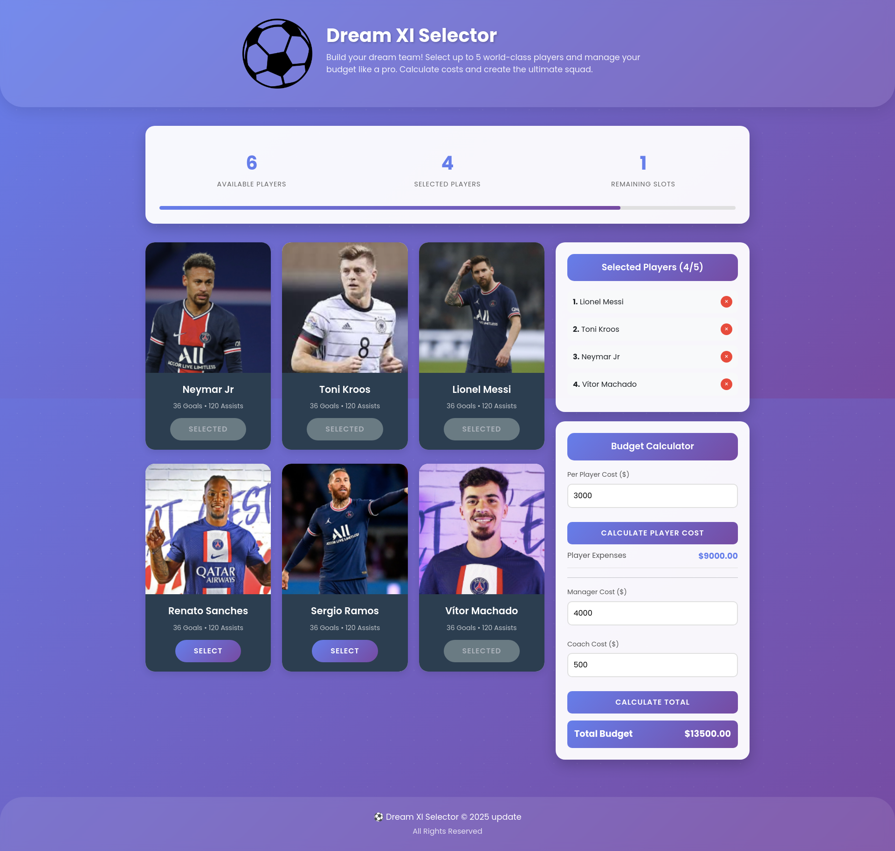

# Dream XI Selector — Build Your Ultimate Football Squad

  
  
  
  
  
  **It is a fun and interactive football team selection web app where users can choose up to 5 world-class players, manage budgets, and calculate team expenses.**
  
  [Live Demo](https://electra51.github.io/Dream-XI-Selector/) · [Report Bug](https://github.com/electra51/Dream-XI-Selector/issues) · [Request Feature](https://github.com/electra51/Dream-XI-Selector/issues)

---

## Preview

  

---

## Core Features

- Choose up to 5 players maximum.
- Automatically prevents selecting more than 5.
- Prevents choosing the same player twice.
- Selected players appear in a right-side selection panel.
- Each selected player can be removed individually.
- Live counter:
  - Available Players
  - Selected Players
  - Remaining Slots
- Animated progress bar based on number of players selected.

## Budget & Expense Calculator

- Input Per Player Cost.
- Calculates total player expenses automatically.
- Add Manager Cost and Coach Cost.
- Full Total Budget Calculation.
- Prevents negative or invalid values.
- Error messages with smooth UI animation.
---

## Technologies Used

| Technology             | Usage                                     |
| ---------------------- | ----------------------------------------- |
| **HTML5**              | Structure & layout                        |
| **CSS3**               | Custom UI styling, animations             |
| **Bootstrap Grid**     | Responsive layout                         |
| **Vanilla JavaScript** | Logic, DOM manipulation, selection system |
| **Google Fonts**       | Typography                                |
| **Shields.io**         | Badges for README                         |

## How to Use

1. Open the project in any browser.
2. Select up to 5 players.
3. Add per-player cost → Calculate.
4. Add manager & coach cost → Calculate total.
5. Remove players anytime.
6. Enjoy building your dream squad!

## Contributing

Contributions are always welcome! Here's how you can help:

1. Fork the project
2. Create your feature branch (`git checkout -b feature/AmazingFeature`)
3. Commit your changes (`git commit -m 'Add some AmazingFeature'`)
4. Push to the branch (`git push origin feature/AmazingFeature`)
5. Open a Pull Request

---

## Author

**Electra51**

- **GitHub**: [@Electra51](https://github.com/Electra51)
- **LinkedIn**: https://www.linkedin.com/in/safayet-nur/
- **Email**: safayetnurelectra@gmail.com
- **Portfolio**: https://nextjs-my-portfolio-electra51.vercel.app/
- **Twitter**: https://x.com/nur_safaye51

---

## Support

If you like this project, please ⭐ star this repository!

---

**Star this repository if you found it helpful!**
### Made with ❤️ by Electra51
Happy Coding! 🚀
